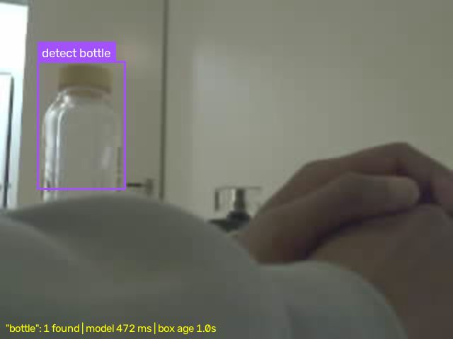

# Text-prompted RC car: PaliGemma 2 on Roboflow's stack

Type "mug" into a web page. The camera on a small RC car streams video to a laptop, PaliGemma 2 draws a box around the mug, and in `find` mode the car pans its camera to search for the mug and keep it centered. Everything on the ML side uses Roboflow tools: model weights come from Roboflow's registry through `inference_models.AutoModel`, `supervision` parses the output and draws the boxes, and fine-tuned versions will load through the same call by `project/version` ID.



*A live frame from the car's camera after the prompt `bottle`. The overlay shows the model's latency (472 ms) and how old the box is relative to the video (1.0 s).*

## How it works

```
 ESP32-S3 CAM (on the car)          LAPTOP (RTX 4050, 6 GB)                                   Pico W (on the car)
 ─────────────────────────          ─────────────────────────────────────────────────          ───────────────────
 OV3660, 320x240 MJPEG ~7 fps ─WiFi─► serve.py  main process: camera, display, HTTP :8000
 firmware/CameraStation              │    └─ model process: PaliGemma 2 3B, 4-bit
                                     │         "detect mug" -> <loc..>x4 -> box
                                     │    └─ find.py: box -> pan angle (SEARCH / TRACK)
                                     ├─► browser  http://localhost:8000/detect
                                     └─► /drive/stream (10 msgs/s, SSE) ─► car_bridge.py ─USB serial─► firmware/SerialDrive
                                                                                "V <pan>", "M 0 0 0 0"    servo + 4 motors
```

| File | Role |
|---|---|
| `vlm.py` | `Grounder`: loads `paligemma2-3b-pt-224` through `inference_models.AutoModel` (4-bit NF4), sends the prompt `detect <obj>`, and parses the answer with `sv.Detections.from_vlm`. Run standalone to benchmark one image. |
| `serve.py` | Web server and live view. The model runs in its own spawned process. As a thread in the server process it was about 2x slower, because the Python GIL was shared with JPEG encoding. |
| `find.py` | Pure controller logic with no hardware: SEARCH sweeps the pan between 95 and 175 degrees, TRACK applies a proportional correction toward the box center. Tested in `test_find.py`. |
| `car_bridge.py` | The only process that opens the serial port. It forwards the command stream to the Pico, sends `S` (stop) if the stream goes quiet for more than 1 s, keeps the wheels at 0 unless you pass `--allow-wheels`, and clamps the pan to 95–175. |
| `camera.py` | `LatestFrame`: keeps only the newest frame of the MJPEG stream, so the model never processes a backlog of old frames. |
| `drive_keys.py` | Manual WASD driving over serial. Its `open_car()` does the `P`→`PONG` handshake to confirm the port really is the car. |
| `look_at.py` | Earlier standalone version (an OpenCV window instead of the web page). Kept for reference. |
| `firmware/` | Arduino sketches for both boards (below). |

### Measured (RTX 4050 laptop, 2026-10-06)

- **Detection latency:** about 850–950 ms per detection with the full answer (6 tokens at about 120 ms per token). Capping generation at the 4 `<loc>` tokens brings it to about 470–500 ms. An empty answer ("not found") takes about 250 ms.
- **VRAM:** 2.68 GB with 4-bit weights.
- **Video:** 7 fps at 320x240. The overlay shows how old each box is, because the box comes from a frame up to about 1 s old.

## Hardware

Hardware isn't the focus of this take-home, but the controller and latency numbers depend on it, so here is the setup:

| Part | Role |
|---|---|
| [Freenove 4WD Car Kit for Raspberry Pi Pico](https://github.com/Freenove/Freenove_4WD_Car_Kit_for_Raspberry_Pi_Pico) (mecanum wheels) **with a Pico W** | Chassis, 4 motors, pan servo on GP13. Runs `firmware/SerialDrive` and takes commands from the laptop over **USB serial**. |
| Freenove ESP32-S3-WROOM CAM (OV3660) | Mounted on the pan servo. Runs `firmware/CameraStation`, joins your 2.4 GHz WiFi, and serves MJPEG at `http://<ip>:81/stream`. |
| Laptop with an NVIDIA GPU (≥ 4 GB free VRAM) | Runs everything else. Tested on Windows 11 with an RTX 4050 Laptop (6 GB). |

**Serial protocol** (`firmware/SerialDrive/SerialDrive.ino`, 115200 baud, one line per command):
`M a b c d` sets the four wheel speeds (-100..100), `S` stops, `V a` sets the servo angle (center = 135 on this car), and `P` replies `PONG`. Safety features in the firmware: if no command arrives for 500 ms, the watchdog stops the motors. Wheel speed is capped at 39% duty in the firmware, so a bug in a Python script can't make the car drive faster than that. The servo moves at about 60 degrees per second.

### Flash the firmware (arduino-cli)

```powershell
# Pico W  (hold BOOTSEL while plugging in USB, car power switch OFF; then copy the .uf2 onto the RPI-RP2 drive)
arduino-cli core install rp2040:rp2040      # board index: https://github.com/earlephilhower/arduino-pico
arduino-cli compile --fqbn rp2040:rp2040:rpipicow firmware/SerialDrive --output-dir firmware/SerialDrive/build

# ESP32-S3 CAM  (flashes over the UART-labelled USB-C port)
copy firmware\CameraStation\wifi_secrets.example.h firmware\CameraStation\wifi_secrets.h   # then fill in SSID/password
arduino-cli core install esp32:esp32
arduino-cli compile --upload -p COM8 --fqbn esp32:esp32:esp32s3:PSRAM=opi,FlashSize=8M,CDCOnBoot=cdc firmware/CameraStation
# (the FQBN the working build used; the sketch's own partitions.csv sets the flash layout)
```

The camera prints `CAMERA_READY ... stream=http://<ip>:81/stream` on its serial port at 115200 baud and advertises the mDNS name `rccam.local`. If it can't join your WiFi within 20 s, it starts its own access point, `Sunshine`, at `192.168.4.1`. **The ESP32 serves only one stream client at a time.** Close any browser tab that has the stream open before you start `serve.py`.

## Software setup

```powershell
py -3.11 -m venv .venv
.venv\Scripts\pip install torch==2.11.0 torchvision==0.26.0 --index-url https://download.pytorch.org/whl/cu128
.venv\Scripts\pip install -r requirements.txt
.venv\Scripts\python -m pytest -q                # 8 controller tests, no hardware needed
```

`requirements-lock.txt` is a `pip freeze` of the environment that produced the numbers above.

**Windows issues you may hit:**
- **`WinError 1314` while loading the model:** `inference_models` creates symlinks in its cache. Turn on *Settings → System → For developers → Developer Mode*.
- **The model runs on CPU and is very slow:** `pip install inference-models` replaced the CUDA build of torch with the CPU build. Re-run the torch line with `--force-reinstall --no-deps`.
- **Wrong camera address:** set your camera's IP in `STREAM_URL` in `camera.py`, or use `http://rccam.local:81/stream`. The `--capture` URL in `vlm.py` also needs updating.

## Run it

```powershell
# 1. Model only, no car. Benchmark one image:
.venv\Scripts\python vlm.py mug path\to\image.jpg          # or: vlm.py mug --capture  (grab a frame from the camera)

# 2. Live boxes in the browser (camera only; the car isn't moved):
.venv\Scripts\python serve.py mug                         # open http://localhost:8000/detect

# 3. Find mode: the camera sweeps to search, then keeps the target centered (pan only; the wheels stay locked):
.venv\Scripts\python serve.py mug --mode find
.venv\Scripts\python car_bridge.py --dry-run              # prints the commands it would send; drop --dry-run to drive COM7
```

The page at `/detect` lets you change the prompt live, switch between DETECT and FIND, and ask the model free-form questions about the current frame (`POST /chat`). It shows the controller state and the command stream. `/detect/status` returns the same information as JSON. `--save-dir runs/x` logs frames together with the model's answers. Those logs are the raw data for the dataset step below.

If `find` mode turns the camera **away** from the target, add `--pan-sign -1` to the `serve.py` command.

## Roadmap

- [x] **v1, detect:** zero-shot PaliGemma 2 boxes on live car video, in the browser.
- [x] **v2a, find (pan only):** a search-and-center controller sends commands through the safety bridge.
- [ ] **v2b, follow:** wheels enabled (`--allow-wheels`), so the car drives toward the target.
- [ ] **Data:** upload frames saved by `--save-dir` to a Roboflow project and label them there.
- [ ] **Post-training:** SFT a LoRA with `maestro`, then a GRPO pass with an IoU reward. Upload the result with `version.deploy("paligemma2-3b-pt-224-peft", ...)` and load it with `serve.py --model <project>/<version> --api-key ...`, with no code changes.
- [ ] **Eval:** offline IoU on held-out frames plus closed-loop time-to-center on the car, for zero-shot vs. SFT vs. GRPO.
